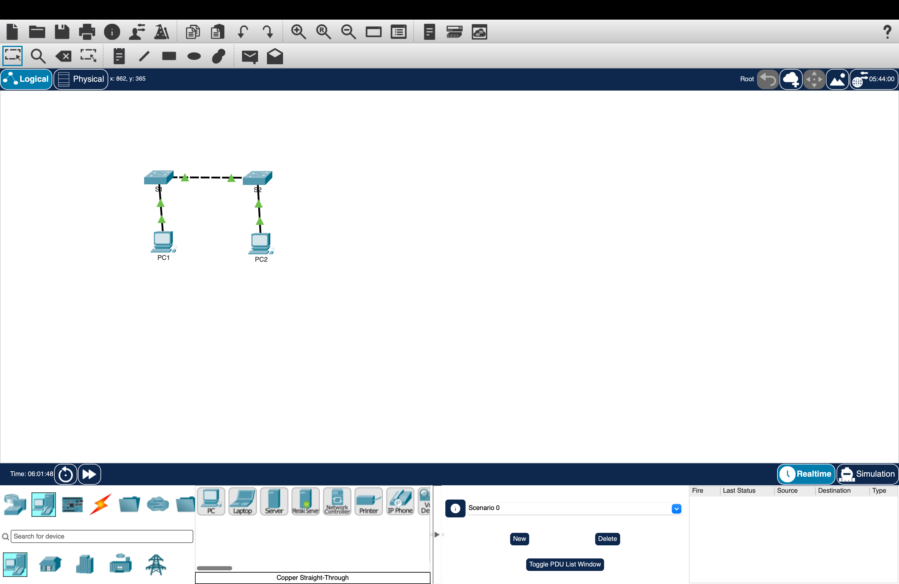

# Lab 01: Implement Basic Connectivity Between PCs and Switches

**Date:** [10/1/26]
**Tools:** Cisco Packet Tracer
**Source:** Based on the Cisco Networking Academy Packet Tracer activity "Implement Basic Connectivity"

## Objective
Configure two switches with secured access and management IP addresses,
give two PCs static addresses, and confirm all four devices can reach
each other.

## Topology


PC1 --- SW1 --- SW2 --- PC2

## Addressing Table

| Device | Interface | IP Address    | Subnet Mask   |
|--------|-----------|---------------|---------------|
| PC1    | NIC       | 192.168.1.1   | 255.255.255.0 |
| PC2    | NIC       | 192.168.1.2   | 255.255.255.0 |
| SW1    | VLAN 1    | 192.168.1.253 | 255.255.255.0 |
| SW2    | VLAN 1    | 192.168.1.254 | 255.255.255.0 |

## Steps
1. Set the hostnames SW1 and SW2 on the switches
2. Configured a console password, an `enable secret`, and a login banner on both
3. Saved the configuration to NVRAM
4. Set static IP addresses on PC1 and PC2
5. Pinged the switches from PC1 before they had IP addresses
6. Configured the VLAN 1 management interface on each switch
7. Verified with `show ip interface brief` and `show running-config`
8. Saved again and tested ping between all four devices

## Configuration (SW1)
```
Switch> enable
Switch# configure terminal
Switch(config)# hostname SW1
SW1(config)# line console 0
SW1(config-line)# password cisco
SW1(config-line)# login
SW1(config-line)# exit
SW1(config)# enable secret class
SW1(config)# banner motd #Authorized access only. Violators will be prosecuted.#
SW1(config)# interface vlan 1
SW1(config-if)# ip address 192.168.1.253 255.255.255.0
SW1(config-if)# no shutdown
SW1(config-if)# end
SW1# copy running-config startup-config
```

SW2 uses the same commands with the hostname `SW2` and the IP address
`192.168.1.254`.

Full configs: [SW1](configs/SW1-config.txt) | [SW2](configs/SW2-config.txt)

> The passwords (`cisco`, `class`) are lab-only values from the exercise.

## Verification

**Before configuring the switch IPs**, pinging SW1 from PC1 failed.
Nothing was answering because the switch had no IP address yet.


**After configuring VLAN 1**, `show ip interface brief` on SW1 shows
Vlan1 up/up at 192.168.1.253:


`show running-config` confirms the hostname, the hashed `enable secret`,
the console password, the banner, and the Vlan1 address.


**Connectivity tests from PC1:**

| Destination | Address       | Result    |
|-------------|---------------|-----------|
| PC2         | 192.168.1.2   | [Success] |
| SW1         | 192.168.1.253 | [Success] |
| SW2         | 192.168.1.254 | [Success] |


## Key takeaways
- A new switch can't be pinged until its VLAN 1 interface has an IP
  address and has been enabled with `no shutdown`
- The IP address on a switch is for management only, not for forwarding
- `enable secret` is stored as a hash, but the console password is
  plaintext unless password encryption is turned on
- Configuration isn't permanent until I copy running-config to
  startup-config